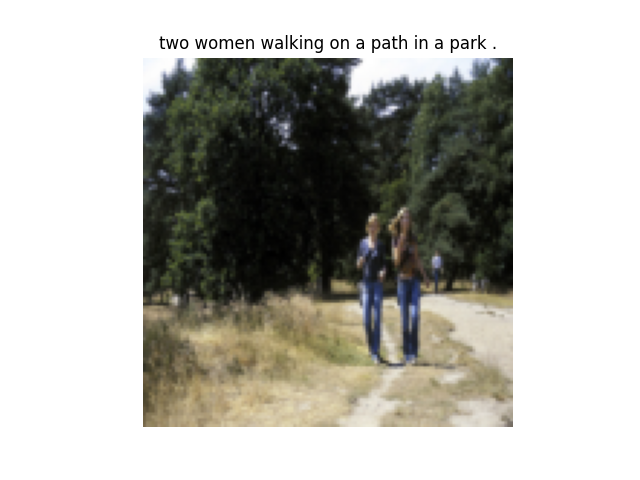

# Image Captioning With Encoder-Decoder Networks
Project for the course Deep Learning 046211 (Technion)
Winter 2023.

Video:

[YouTube](https://youtu.be/i8Cnas7QrMc) - https://youtu.be/HsJHZepSWHU
(in hebrew).


- [Encoder Decoder Image Captioning](Image Captioning With Encoder-Decoder Networks)
  * [Background](#Background)
  * [Prerequisites](#prerequisites)
  * [Files in the repository](#files-in-the-repository)
  * [Results](#results)
  * [Examples](#examples)
  * [References](#references)

## Background
Image captioning is the task of generating short sentences that describe the content of an image. 
The goal of this project is to implement an encoder-decoder network for image captioning. 
The encoder is a pre-trained CNN, and for the decoder we used both LSTM and Transformer networks.
The network is trained on the [Flickr8k](https://www.kaggle.com/adityajn105/flickr8k/activity) dataset.

## Prerequisites
Full lists of requirements are in the requirements.txt file.
Require python version is 3.10.9.
To install the requirements run:
```pip install -r requirements.txt```


## Files in the repository

|File name         | Purpsoe |
|----------------------|------|
|'data.py' | Data loader and additional scripts for the flickr8k datasets.|
|'models.py' | All the models used in the project (Transformer, LSTM, resnet50k).|
|'train.py' | Training script.|
|Example_Images | Folder with example images for the README.md file.|
|'LSTM_optuna.py' | Optuna hyperparameter tuning script for the LSTM model.|
|'Transformer_optuna.py' | Optuna hyperparameter tuning script for the Transformer model.|
|'Transformer_full.csv'| Results for the Transformer model during final training.|

## Displaying Results
The full results for the Transformer model training are in the 'Transformer_full.csv' file.
In order to replicate the results 
## Training
In order to train the model one should clone the repository, select the model class (Transformer / LSTM)
and select the required hyperparameters in the script (the optimal hyperparameters we used are already in the script).
## Examples





## References:
* https://www.kaggle.com/code/itaishufaro/flickr-30k-data-loader-preparation-pytorch/edit (Based data loader on this script).
